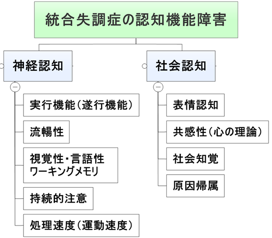

cognition_01

# 認知機能障害とは

- 会社員。発症前は人とのコミュニケーションは特に問題無かったが、発症により治療を受けて改善してから、人と接するのが面倒になって人に会わないようにしている。人前で言葉が出なくて、それで嫌な気分になるから
　　→流暢性
主婦。買い物をしていて、レジで大まかにいくらかかるかが計算できなくなって、買い物時は緊張するようになった
　　→処理速度・遂行機能
会社員。仕事は早いほうであったが発症により精神科に通院し改善したが、職場復帰しても沢山の仕事を前にして計画がたてられず頭が真っ白になることが増えた
　　→遂行機能
大学生。テレビのサッカー観戦が好きだが、興味を持って見ているのに今までの展開が思い出せなくて愕然とする機会が増えた
　　→作業記憶
