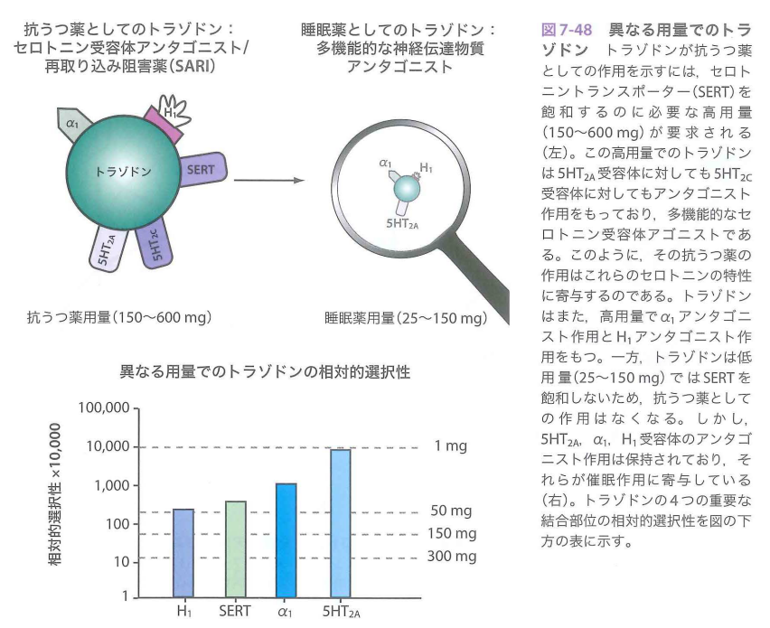
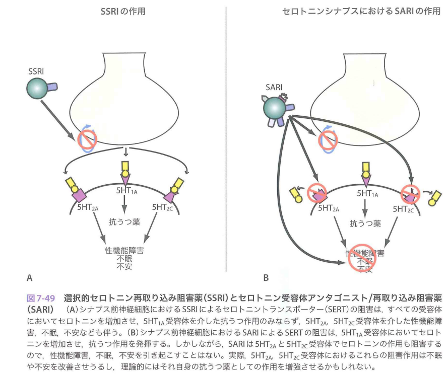

トラゾドン

- デジレル（ファイザー）、レスリン（MSD）
- 抗うつ薬
- 睡眠薬：低用量では5HT2A阻害作用、H1阻害作用、アルファ1阻害作用
- 抗うつ薬：高用量。セロトニントランスポーター阻害、5HT2C阻害
- トラゾドンはSARIと呼ばれる。セロトニン遮断再取り込み阻害薬(SARI;Serotonin 2 Antagonist and Reuptake Inhibitor)
- 半減期が短いので、睡眠薬として用いた場合は持ち越し効果が無い
- 速放錠では鎮静が出るので、あまり抗うつ薬としては理想ではない。そのため徐放錠があり、夜に内服する。
- 

トラゾドンの作用機序

## トラゾドンとSSRIの相違

SSRIは5HTを増やすが、他方で、刺激が良くない受容体に作用する。

5HT2A、5HT2Cの刺激は性機能障害、不眠、不安が生じる

リンク  
精神薬理学エッセンシャルズ4版.pdf  183p
