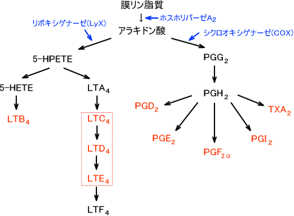
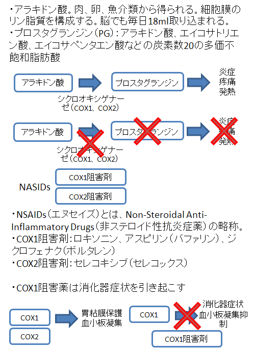

アラキドン酸

### アラキドン酸カスケード

- 細胞膜から遊離したアラキドン酸から3つの代謝経路の総称。下図が概要  
    
- シクロオキシゲナーゼはCOXと書く。アラキドン酸はシクロオキシゲナーゼによって、プロスタグランジンG2（PGG2）、PGH2に変換される。
- ｔ
- よ
- ま
- き
- 参考URL  
    [https://bsd.neuroinf.jp/wiki/アラキドン酸](https://bsd.neuroinf.jp/wiki/%E3%82%A2%E3%83%A9%E3%82%AD%E3%83%89%E3%83%B3%E9%85%B8)

### NASIDs

NSAIDs（エヌセイズ）とは、Non-Steroidal Anti-Inflammatory Drugs（非ステロイド性抗炎症薬）の略称。

- NSAIDsの作用機序を言え  
    アラキドン酸は細胞膜のリン脂質を構成する。遊離して3つの代謝酵素で代謝される過程をアラキドン酸カスケードという。シクロオキシゲナーゼはCOXと呼ばれCOX1とCOX2がある。シクロオキシゲナーゼによってプロスタグランジンに代謝される。多数の物質があり多様な生理作用があるが、基本的なものとして炎症、疼痛、発熱が生じる。NSAIDsは非ステロイド性抗炎症薬の略で、COX1阻害薬はロキソニンやアスピリンがある。COX1阻害薬の副作用として胃粘膜が荒れる、血小板凝集の抑制がある。COX2阻害薬がセレコキシブ、商品名セレコックスである。