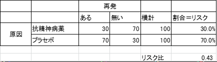

統合失調症

## 寛解と回復

　 
Libermanの定義：①症状の寛解（Brief Psychiatric Rating Scaleによるすべての陽性症状，陰性症状の得点が4点以下）、心理社会的な機能として②就労ないし就学（半日程度以上），③自立した生活（金銭面，治療面においても），④社会的人間関係の構築（週1回以上の友人との付き合い）のすべてを2年以上持続すること　 
　Liberman RP et al．Psychiatr Serv．2005；56：735－42　

リカバリー率について、37本の論文50試験のメタ解析の回復率は中央値で13.5%だった　

　
Schizophr Bull. 2013 Nov;39(6):1296-306. doi: 10.1093/schbul/sbs130. Epub 2012 Nov 20.
　シゾの回復リカバリの50本のメタ解析Jaaskelainen2013.pdf　

---
## 再発

Leucht2012のメタ解析では65本の抗精神病薬とプラセボのRCTについて、抗精神病薬継続は7-1ヶ月の再発率を低下させた（RR:0.4）。再燃、再発までの期間を延長させ、再入院率を低下させた。

　
Lancet. 2012 Jun 2;379(9831):2063-71. doi: 10.1016/S0140-6736(12)60239-6. Epub 2012 May 3.Antipsychotic drugs versus placebo for relapse prevention in schizophrenia: a systematic review and meta-analysis.

Kishimoto2013、FGAとSGAの再発予防効果を比較した、RCTで6ヶ月以上追跡した23本の試験（n=4504）はSGA全体はFGAよりも再発率が有意に低下していた（RR:0.8）。3，6，12ヶ月時点での再燃、再発、入院、治療失敗もSGA優位であった。第1世代、第2世代の再発予防効果に関する23の研究のメタ解析では、個々の研究で差は無いが、メタ解析では相対危険度0.8で第2世代が予防効果が高く、3, 6, 12ヶ月時点での再発が少なく、入院も少なかった。Kishimoto et al, 18, Mol Psychiatry, 2013

　
https://www.ncbi.nlm.nih.gov/pubmed/22124274

